

  <h1 align="center">Projet-SpringBoot</h1>
  
Kaddem Web Application (Mac, Windows and Linux)

## 📢 Announcement

### « Kaddem », c’est quoi?:
C’est un projet qui vise à encourager les jeunes
étudiants à améliorer leurs compétences professionnelles notamment
dans le cadre des nouvelles tendances du monde de l’informatique.

### Objectif:
Dans le but de préparer les étudiants aux nouvelles exigences
du marché d’emploi, nous proposons de travailler sur le projet «
KADDEM ».

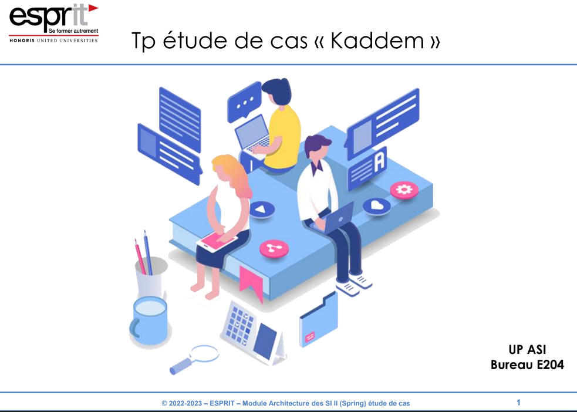

### Diagramme de classes

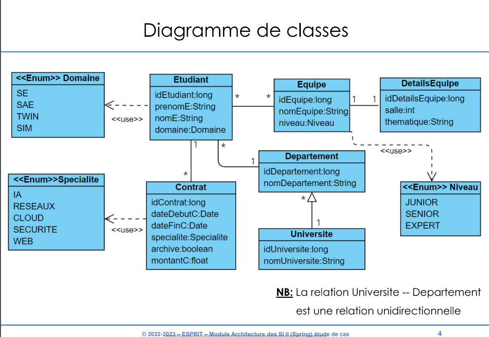
### Technologie
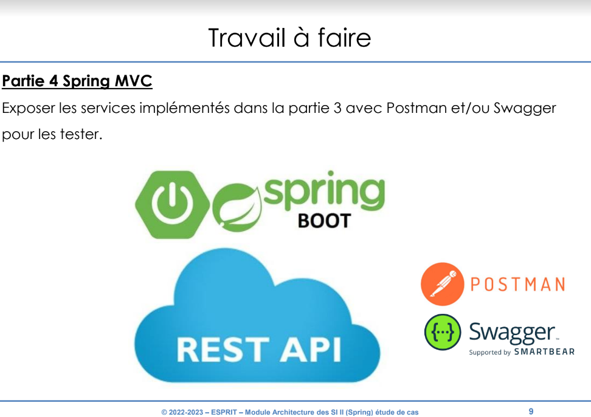

### 📖 Spring Data JPA : Première entité et Lombok

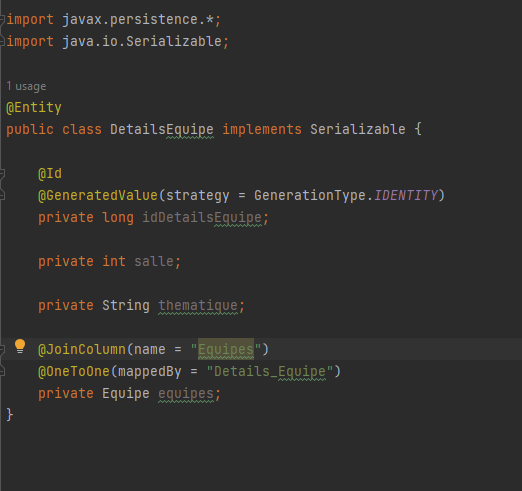
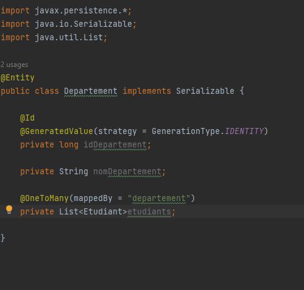
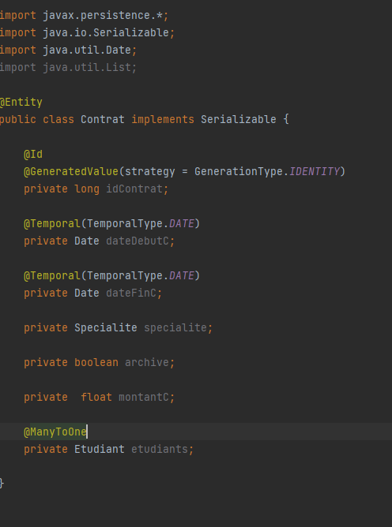
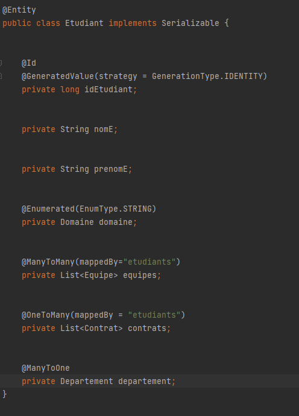

### 📖 Spring Data JPA : JPARepository et Spring IOC
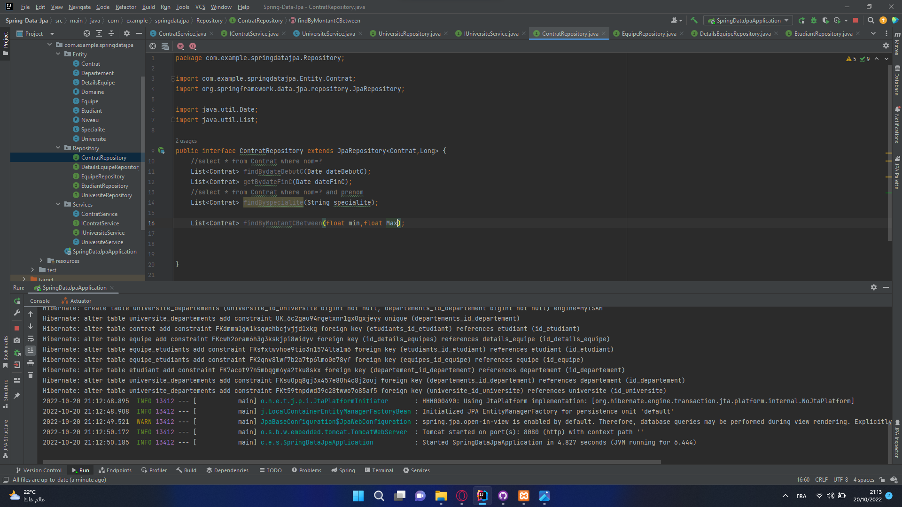

### Spring Data JPA et Spring Docs
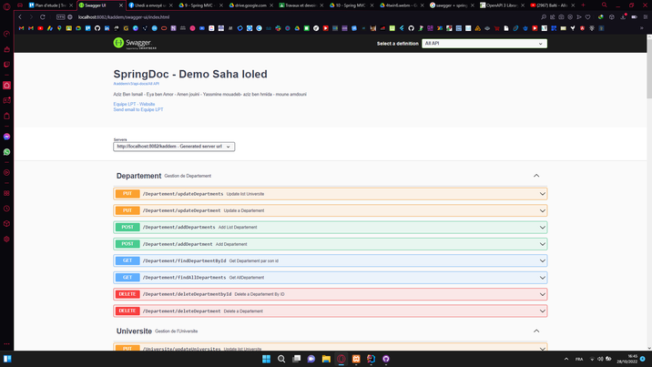
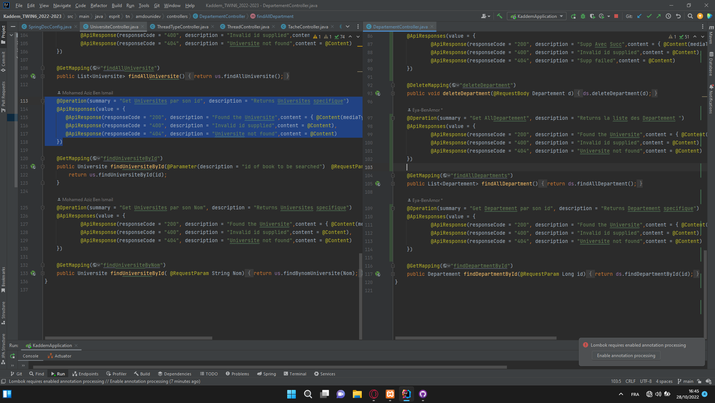

### Fonction Avancé
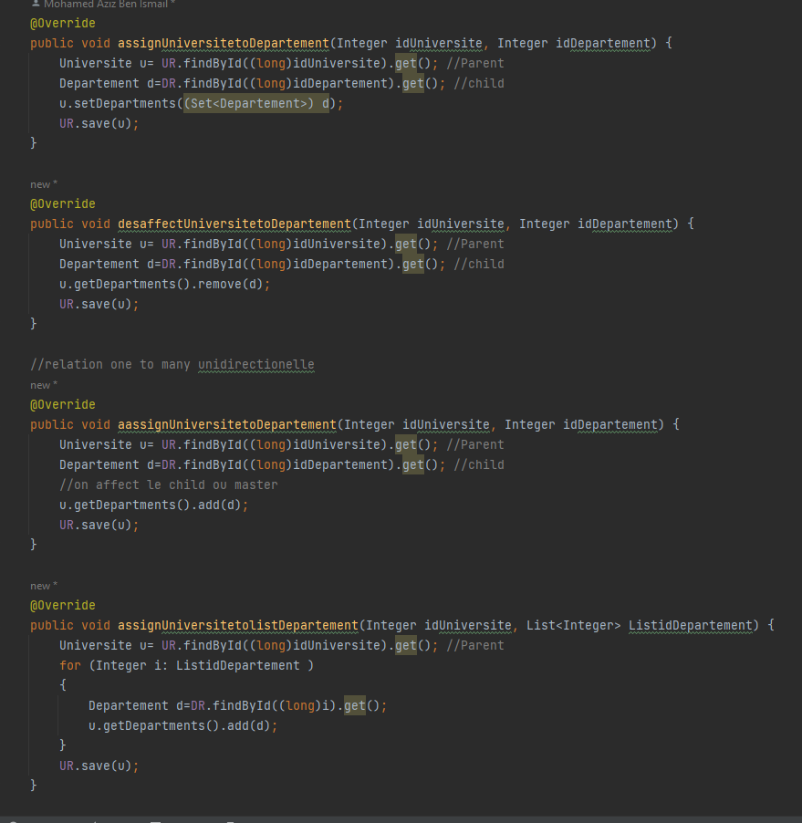

### Spring AOP
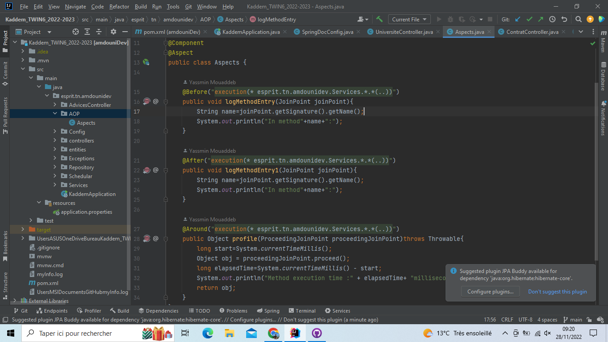

